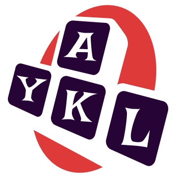

# Yet Another Key Logger (YAKL) :trollface:

Welcome to **YAKL** – A Simple Keylogger Built Using Windows API!

## What is YAKL? 📚
**YAKL** (Yet Another Key Logger) is a basic keylogger designed to monitor and record keystrokes on Windows systems using the Windows API. This project is intended for educational purposes to demonstrate how keylogging mechanisms function and how Windows APIs can be used for low-level system interactions.

---

## Key Features 🧷

- **Windows API Integration:** Uses native Windows APIs to hook into keyboard input.
- **Real-time Keystroke Logging:** Logs each keypress and stores it in a local file.
- **Lightweight:** Minimal CPU and memory overhead.
- **Customizable:** Easily customizable for various logging and output requirements.
- **Educational:** Learn how Windows APIs interact with user input and how keystroke monitoring works.

---

## How Does It Work? 📚

YAKL hooks into the Windows API and listens for keyboard events using the `SetWindowsHookEx` function. Once a key is pressed, it captures the keystroke and logs it to a file. The keylogger operates in the background, meaning the user won't know it's running unless the system is actively being monitored.

**Note:** This keylogger is designed purely for educational purposes. Unauthorized usage for malicious activity is illegal and unethical.

---

## Prerequisites 🧾

Before you can run YAKL, ensure that you have the following prerequisites:

- **Operating System:** Windows (Windows 7, 8, 10, or 11)
- **Development Environment:**
  - Visual Studio (Recommended)
  - C++ Compiler (MSVC)
  - Windows SDK for API integration

---

## How to Build 🔨

1. **Clone the Repository:**
   ```bash
   git clone https://github.com/opencodeiiita/YAKL.git
   ```

2. **Open the Solution in Visual Studio:**
   - Open `YAKL.sln` in Visual Studio.

3. **Build the Project:**
   - Press `Ctrl + Shift + B` to build the solution.

4. **Run the Keylogger:**
   - Run the project in Visual Studio or compile it into an executable and run it on a Windows machine.

---

## How to Use 🧷

1. **Start the Keylogger:**
   - After running the executable, YAKL will start monitoring keystrokes.

2. **Stop the Keylogger:**
   - Press `Ctrl + C` in the terminal to stop the keylogger (if run from a command prompt).
   - Alternatively, stop the application from the Task Manager.

---

## Key API Functions Used 🚀

- `SetWindowsHookEx`: Hooks into keyboard events to capture keypresses.
- `CallNextHookEx`: Passes the keystroke information to the next hook procedure.
- `GetAsyncKeyState`: Optionally, this function could be used to monitor individual key states.

---

## Important Notes 🧾

- **Ethical Usage:** This project is intended for educational purposes to explore how keyloggers work and how they can be prevented. Do not use this software for malicious activities.
- **Permissions:** Running this keylogger may require elevated privileges depending on system security settings.
- **Antivirus Software:** Some antivirus programs might flag this as malicious due to its keylogging behavior. Use it responsibly and on your own system for learning purposes.
- **Legal Warning:** Unauthorized use of keyloggers on other people's machines without consent is illegal. Always respect others' privacy and the law.

---

## Future Improvements

- **Data Encryption:** Implement encryption for logged data to improve privacy.
- **Remote Logging:** Implement functionality to send logs to a remote server.
- **UI:** Build a simple user interface for easier configuration and logging management.
- **Stealth Mode:** Improve the keylogger’s ability to run silently in the background.

---

## Contributing 📝

This project is open to contributions! If you have an idea to improve the project, feel free to open an issue or create a pull request.

### Steps to Contribute:
1. Fork the repository.
2. Create a branch for your feature.
3. Commit your changes.
4. Push to your fork and create a pull request.

### 📁 Directory Structure

```bash
.
├─ 📁 Project Folder
    ├── 📁 build
    ├── 📁 include
    ├── 📁 lib
    ├── 📁 src
    └── 📄 README.md
```

### PR Template 

```markdown
Issue: #

Short description of what this resolves:

Changes proposed in this pull request and/or Screenshots of changes:
```

---

## License

This project is licensed under the MIT License - see the [LICENSE](LICENSE) file for details.

---

## Disclaimer ⚠️

**YAKL** is a demonstration tool for educational purposes only. Misuse of this software could lead to legal consequences. Use responsibly and ensure you are complying with all local laws and regulations.

---

**Happy Hacking!**
